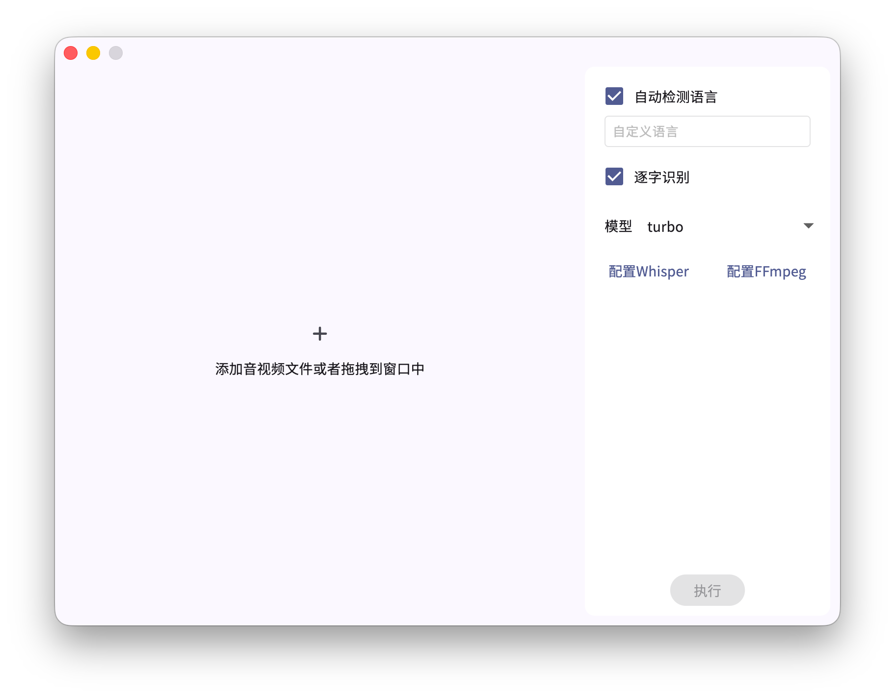
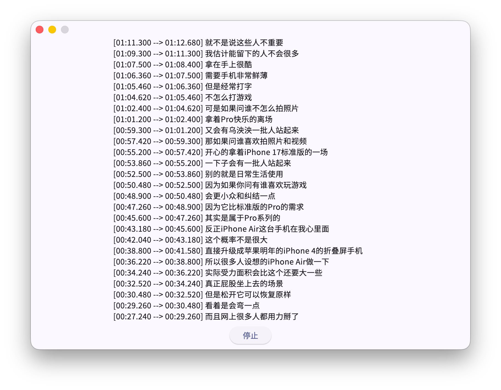

# Whisper GUI

## 简介


这是个Whisper的GUI程序，**你需要在你的设备上安装Whisper和FFmpeg**

## 使用环境

> [!NOTE]
> 注意，macOS系统上收系统限制，需要手动定位Whisper和FFmpeg路径，你可以通过which ffmpeg和which whisper查看路径

- 安装Python3并且使用命令安装Whisper:
  ```bash
  pip install -U openai-whisper
  ```
- 安装FFmpeg，建议添加到环境变量（如果没有添加可以手动设置）

## 截图




